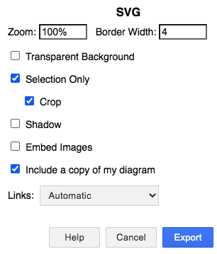

# Concept Maps

Mental models used in introductory data science lessons.

All material made available under the [Creative Commons - Attribution license](LICENSE.md).

## dplyr

[Greg Wilson][wilson-greg]

## select

[Greg Wilson][wilson-greg]

## filter

[Greg Wilson][wilson-greg]

## mutate

[Greg Wilson][wilson-greg]

## group_by and summarize

[Greg Wilson][wilson-greg]

## data types

[Meghan Sposato][sposato-meghan],
[Brendan Cullen][cullen-brendan]

## pivoting

Florian Schmoll

## separate - extract - unite

[Greg Wilson][wilson-greg]

## factors

[Ildiko Czeller][czeller-ildiko], [Graham Parsons][parsons-graham]

## R Markdown

[Gabriela Sandoval][sandoval-gabriela],
[Florencia D'Andrea][dandrea-florencia],
[Yanina Bellini Saibene][bellini-saibene-yanina]

## Visualization

[Greg Wilson][wilson-greg]

---

## Formatting

-   All diagrams are created with diagrams.net,
    which can be [used online](https://app.diagrams.net/)
    or [downloaded](https://github.com/jgraph/drawio-desktop/releases/tag/v13.6.2)
    from [the project's GitHub repository](https://github.com/jgraph/drawio)
    (approximately 100MB).

-   Use the "Sketch" style,
    which can be chosen from the "Style" menu when no elements are selected.
    (See [this blog post](https://www.diagrams.net/blog/rough-style) for details.)

-   Use #FEFEFF (very pale blue) as a background color
    and #000080 (very dark blue) for lines and text.
    This makes it easy to change colors by replacing strings in the generated SVG,
    though changing colors in the PNG requires editing and re-exporting.

-   Show concepts with rounded rectangles:
    -   1pt outline using #000080
    -   No fill
    -   12pt Helvetica font
    -   If there is a central concept:
        -   3pt outline
        -   Make text bold and italic

-   Show relationships with arrows:
    -   3pt lines using #000080
    -   12pt Helvetica
    -   No background for text
    -   Connect both ends to anchor points on concepts
    -   Move text as needed so that it does *not* lie on the line

## Exporting

-   Please export SVG and PNG by selecting everything and then using these settings:
    -   Zoom: 100%
    -   Border Width: 4 pixels
    -   Selection Only
        -   Crop
    -   Include a copy of my diagram

-   Do *not* select "Transparent Background", "Shadow", or "Embed Images".

<table cellpadding="4px">
  <tr>
    <td></td>
    <td></td>
  </tr>
</table>

## Discussion

-   **Why concept maps?**
    They help authors figure out what they want to teach,
    give other instructors a quick overview of a lesson,
    and allow learners to check that they have constructed the right mental model.

-   **What about translations?**
    We hope eventually to be able to store translated text in the `.drawio` files.
    For now,
    please copy an existing diagram and save it in the appropriate language directory
    (e.g., `af/topic.drawio` for concept maps in Afar).

-   **Why SVG?**
    Because vector diagrams rescale much more smoothly than raster images.

-   **Why not use color? Or more shapes? Or...?**
    The simpler these diagrams are,
    the easier they will be to maintain.
    Simple diagrams also display better on smaller or older devices.

-   **Why not use [Graphviz](https://graphviz.org/),
    [DiagrammeR](https://rich-iannone.github.io/DiagrammeR/),
    or some other tool that compiles text into diagrams?**
    1.  As [these graphviz-generated files](./dot/README.md) show,
        it's hard to get their automatic layout algorithms
        to do as good a job as a person can do.
    2.  They have a much steeper learning curve,
        which means fewer people will be able to contribute.
    3.  They don't actually make version control easier
        (reading and understanding the textual description of a diagram
        is as hard as viewing two diagrams side by side).

[cullen-brendan]: https://bcullen.rbind.io/
[czeller-ildiko]: https://ildiczeller.com/
[parsons-graham]: http://grahamrp.com/
[sposato-meghan]: https://education.rstudio.com/trainers/people/sposato+meghan/
[wilson-greg]: http://third-bit.com
[sandoval-gabriela]: https://twitter.com/GabySandovalM
[dandrea-florencia]: https://florencia.netlify.app/
[bellini-saibene-yanina]: https://yabellini.netlify.app/
