# Concept Maps

Mental models used in introductory data science lessons.

All material made available under the [Creative Commons - Attribution license](LICENSE.md).

-   [Concept Maps](#concept-maps)
    -   [dplyr](#dplyr)
    -   [select](#select)
    -   [filter](#filter)
    -   [mutate](#mutate)
    -   [group_by and summarize](#group_by-and-summarize)
    -   [data types](#data-types)
    -   [pivoting](#pivoting)
    -   [separate - extract - unite](#separate---extract---unite)
    -   [factors](#factors)
    -   [R Markdown](#r-markdown)
    -   [regular expressions](#regular-expressions)
    -   [pipe operator](#pipe-operator)
    -   [clustering](#clustering)
    -   [data syndication](#data-syndication)
    -   [Make](#make)
    -   [functions](#functions)
    -   [program configuration](#program-configuration)
    -   [column names](#column-names)
    -   [learnr tutorial](#learnr-tutorial)
    -   [across](#across)
    -   [Boolean](#boolean)
-   [Under Development](#under-development)
    -   [visualization](#visualization)
    -   [join](#join)
-   [Inspirations](#inspirations)
-   [Contributing](#contributing)
    -   [Formatting](#formatting)
    -   [Exporting](#exporting)
    -   [Discussion](#discussion)

## Concept Maps

### dplyr

<a href="es/dplyr.svg">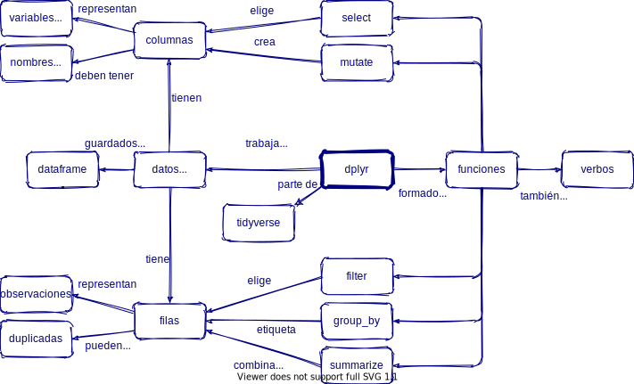</a>

Monica Alonso,
[Greg Wilson][wilson-greg]

### select

<a href="es/select.svg">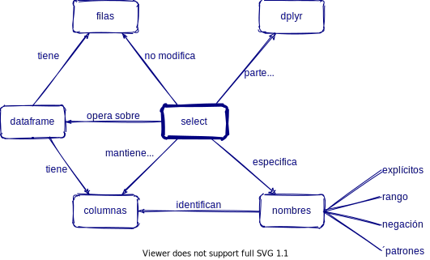</a>

Monica Alonso,
[Greg Wilson][wilson-greg]

### filter

<a href="es/filter.svg">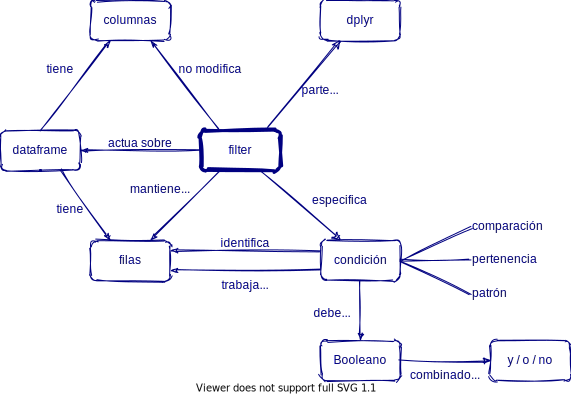</a>

Monica Alonso,
[Greg Wilson][wilson-greg]

### mutate

<a href="es/mutate.svg">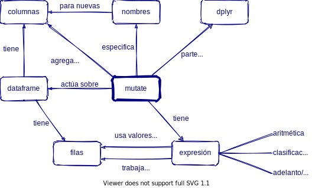</a>

Monica Alonso,
[Greg Wilson][wilson-greg]

### group_by and summarize

<a href="es/group_by-summarize.svg">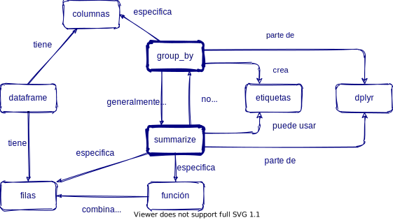</a>

Monica Alonso,
[Greg Wilson][wilson-greg]

### data types

<a href="es/data-types.svg">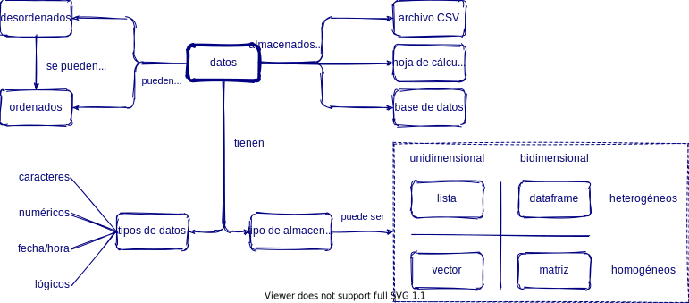</a>

[Meghan Sposato][sposato-meghan],
[Brendan Cullen][cullen-brendan],
Monica Alonso

### pivoting

<a href="es/pivoting.svg">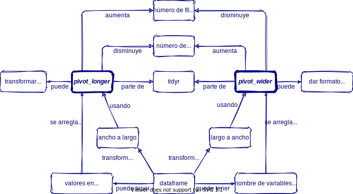</a>

Florian Schmoll,
Monica Alonso

### separate - extract - unite

<a href="es/separate-extract-unite.svg">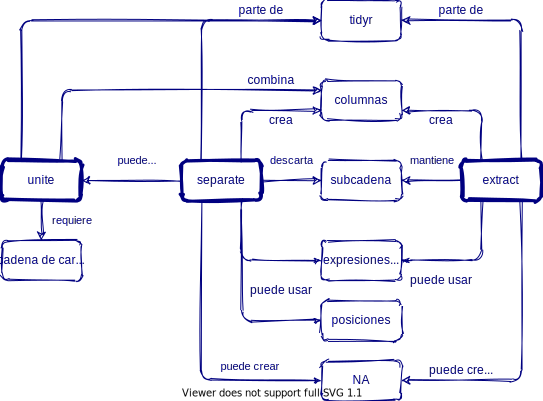</a>

Monica Alonso,
[Greg Wilson][wilson-greg]

### factors

<a href="es/factors.svg">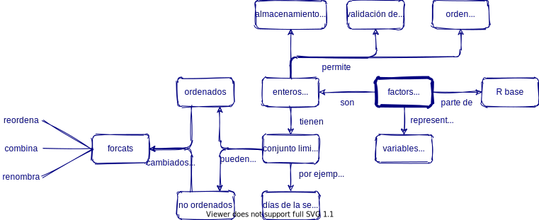</a>

[Ildiko Czeller][czeller-ildiko],
[Graham Parsons][parsons-graham],
Monica Alonso

### R Markdown

<a href="es/rmarkdown.svg">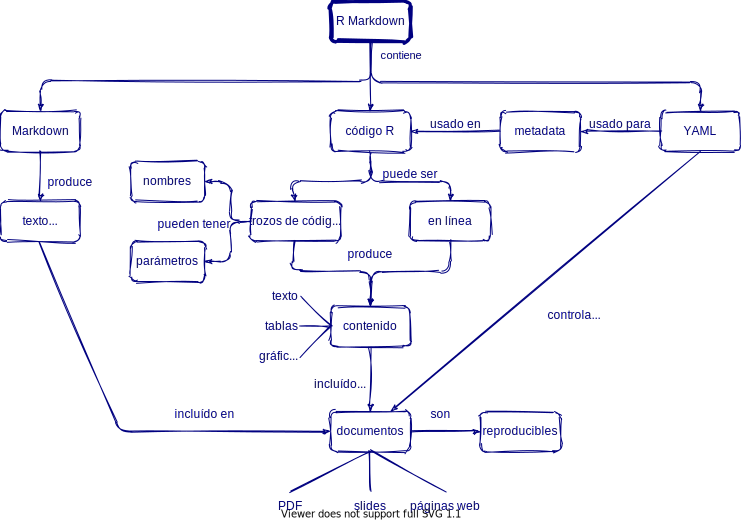</a>

[Gabriela Sandoval][sandoval-gabriela],
[Florencia D'Andrea][dandrea-florencia],
[Yanina Bellini Saibene][bellini-saibene-yanina],
Monica Alonso

### regular expressions

<a href="es/regular-expressions.svg">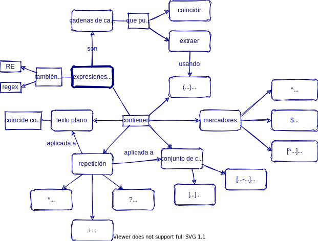</a>

Monica Alonso,
[Greg Wilson][wilson-greg]

### pipe operator

[Jeroen Janssens][janssens-jeroen],
Monica Alonso

### clustering

[Uli Niemann][niemann-uli]

### data syndication

<a href="en/data-syndication.svg">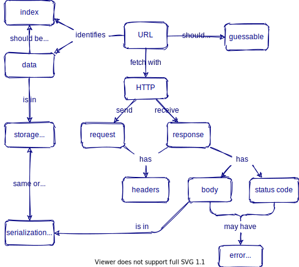</a>

[Greg Wilson][wilson-greg]

### Make

[Greg Wilson][wilson-greg]

### functions

[Greg Wilson][wilson-greg]

### program configuration

<a href="en/program-configuration.svg">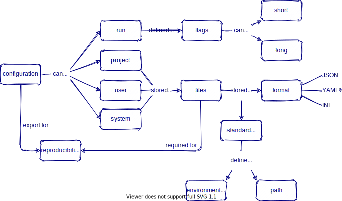</a>

[Greg Wilson][wilson-greg]

### column names

<a href="en/column-names.svg">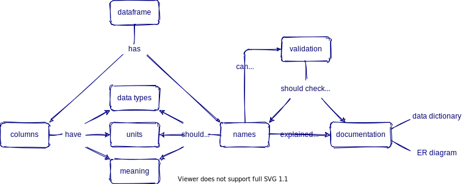</a>

[Emily Riederer][riederer-emily] (originally in [this blog post](https://emilyriederer.netlify.app/post/column-name-contracts/))

### learnr tutorial

[Yanina Bellini Saibene][bellini-saibene-yanina]

### across

<a href="en/across.svg">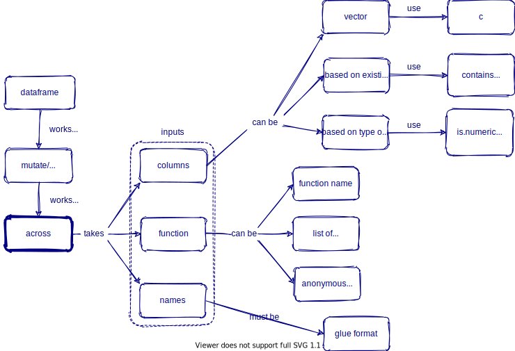</a>

[Emma Vestesson][vestesson-emma]

### Boolean

<a href="en/boolean.svg">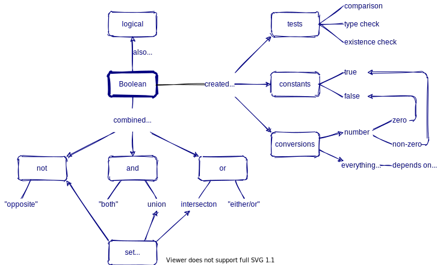</a>

[Greg Wilson][wilson-greg]

## Under Development

### visualization

*This one is still unsatisfactory: please [contact us](mailto:greg.wilson@rstudio.com) with suggestions or submit a pull request to this repository.*

Monica Alonso,
[Greg Wilson][wilson-greg]

### join

*This one is still unsatisfactory: please [contact us](mailto:greg.wilson@rstudio.com) with suggestions or submit a pull request to this repository.*

<a href="en/join.svg">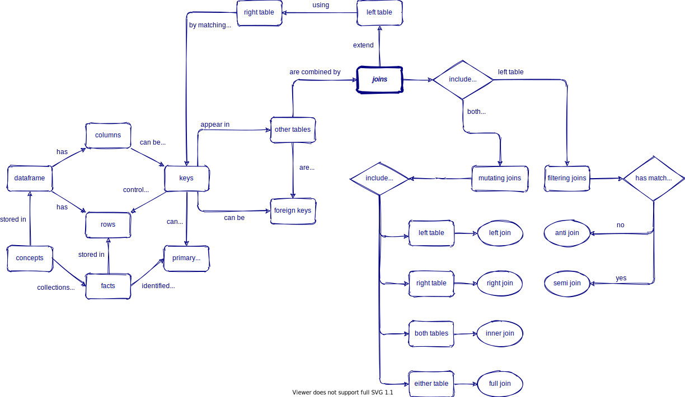</a>

[Greg Wilson][wilson-greg]

## Inspirations

### Dates and Times

<a href="inspirations/datetime-silvia-canelon.png">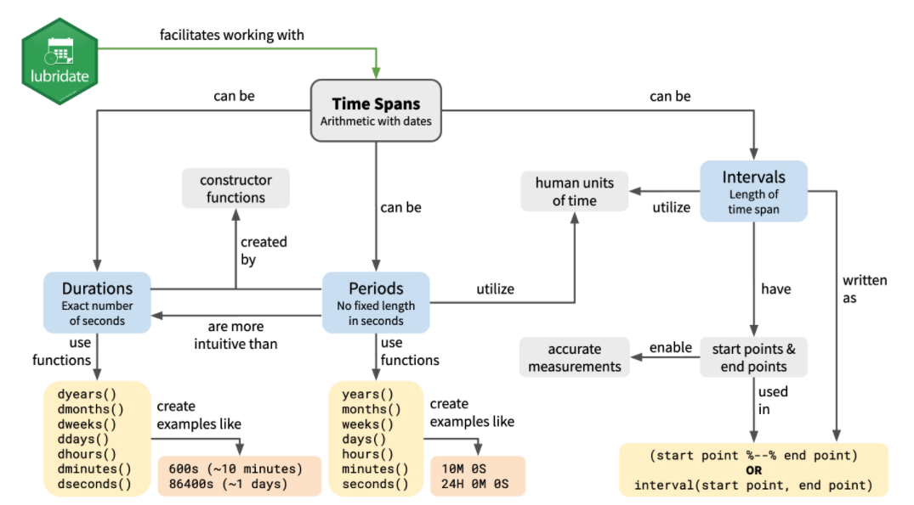</a>

Silvia Canelón

### HTTP

<a href="inspirations/http.png">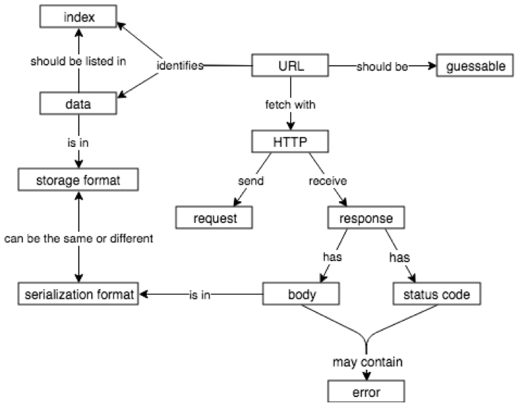</a>

Greg Wilson

### Map

<a href="inspirations/map-lefkios-paikousis.png">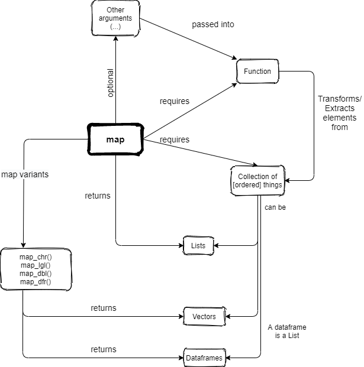</a>

Lefkios Paikousis

### Missing Values

<a href="inspirations/missing-values-roman-popat.png">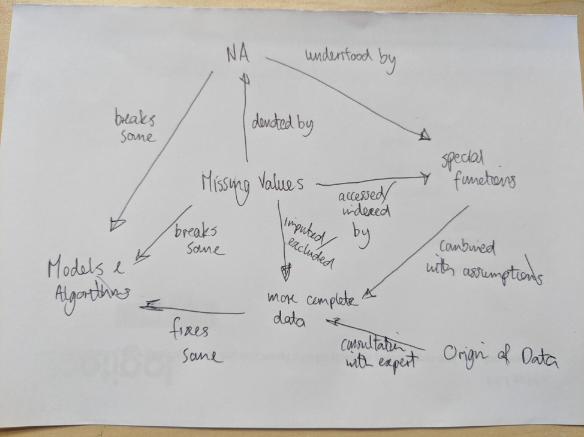</a>

Roman Popat

### Neural Networks

<a href="inspirations/neural-networks-omayma-said.png">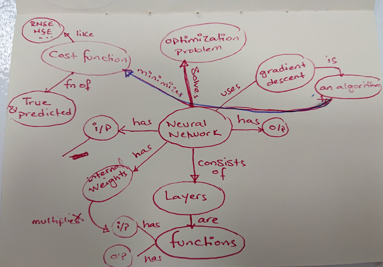</a>

Omayma Said

### Text Analysis

<a href="inspirations/text-analysis-ahmad-husain-abdullah.png">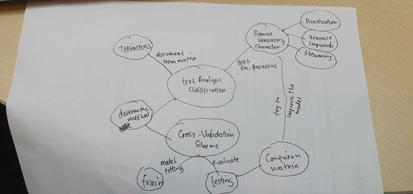</a>

Ahmad Husain Abdullah

### Visualization

<a href="inspirations/visualization-corrado-lanera.png">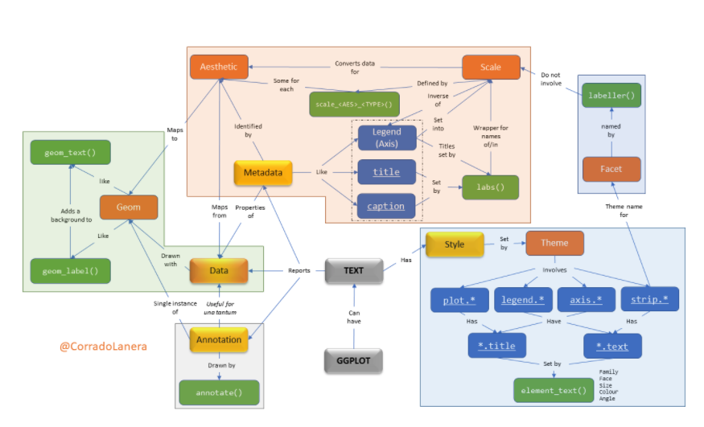</a>

Corrado Lanera

### RStudio Products

<a href="inspirations/rstudio-products-carl-howe.png">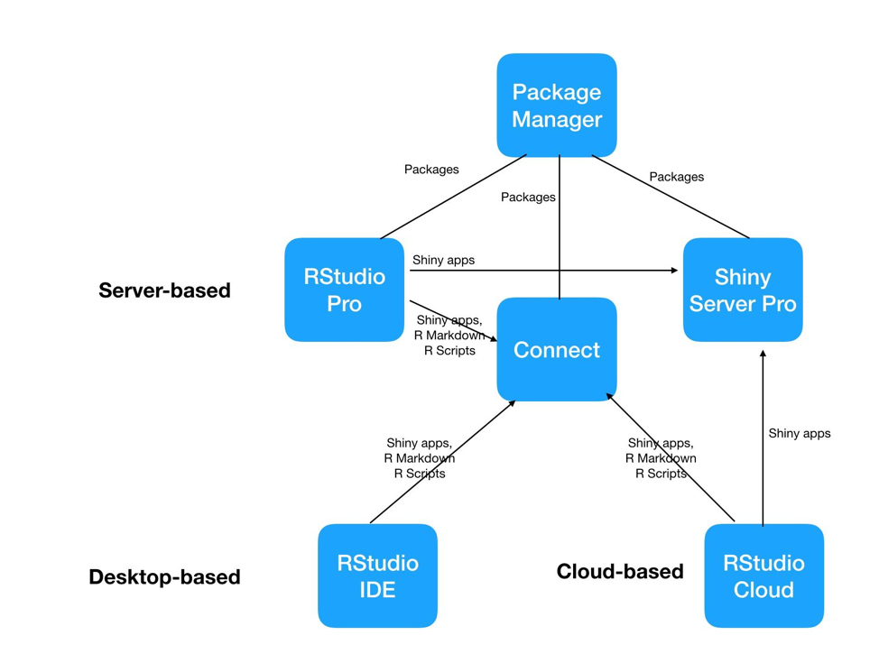</a>

Carl Howe

### Administering RStudio Server Pro

<a href="inspirations/administering-rstudio-server-pro-andrie-de-vries.png">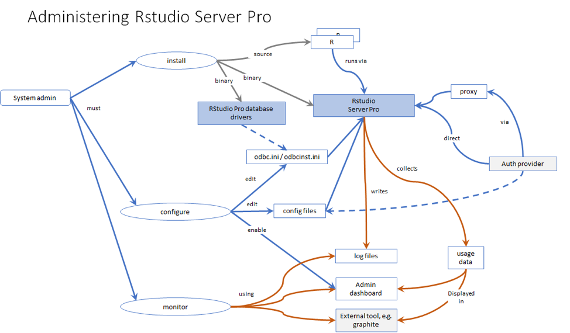</a>

Andrie de Vries

### RStudio Server Pro Configurations (simple and complex)

<a href="inspirations/rsp-connect-simple-andrie-de-vries.png">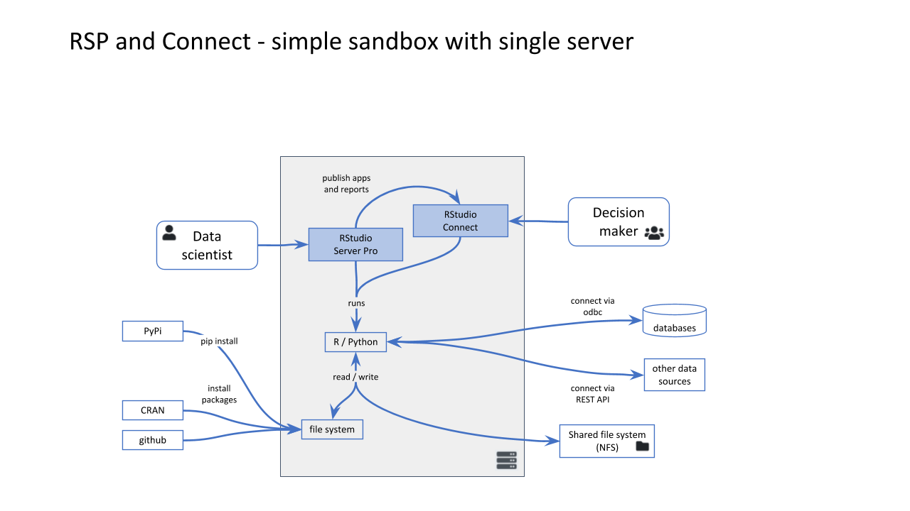</a>
<a href="inspirations/rsp-connect-complex-andrie-de-vries.png">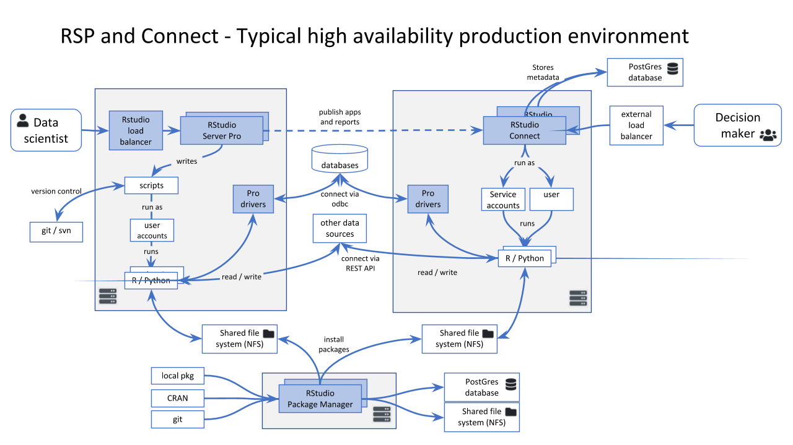</a>

Andrie de Vries

### Setting Up RStudio Server Pro

<a href="inspirations/rsp-setup-andrie-de-vries.png">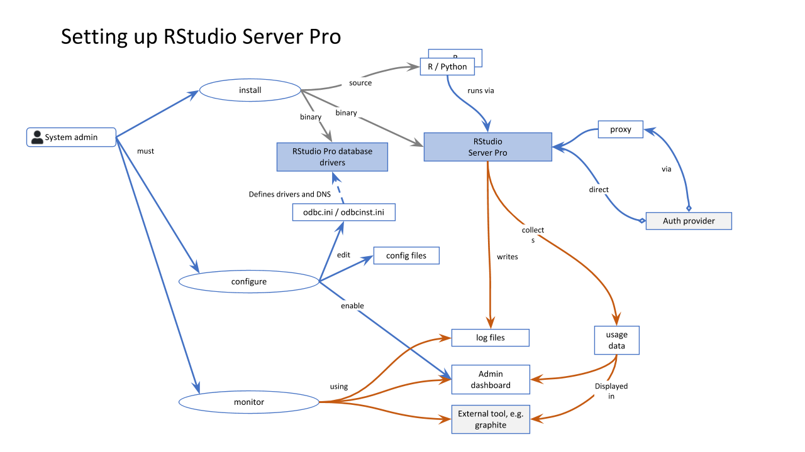</a>

Andrie de Vries

### programs

Greg Wilson

### variables and values

Greg Wilson

## Contributing

### Formatting

-   All diagrams are created with diagrams.net,
    which can be [used online](https://app.diagrams.net/)
    or [downloaded](https://github.com/jgraph/drawio-desktop/releases/tag/v13.6.2)
    from [the project's GitHub repository](https://github.com/jgraph/drawio)
    (approximately 100MB).

-   Save all diagrams as "Editable SVG"
    (a superset of the SVG standard that includes information about anchor points and connections).

-   Use the "Sketch" style,
    which can be chosen from the "Style" menu when no elements are selected.
    (See [this blog post](https://www.diagrams.net/blog/rough-style) for details.)

-   Use #FEFEFF (very pale blue) as a background color
    and #000080 (very dark blue) for lines and text.
    Use 1pt lines, no fill, and 12pt Helvetica.
    If there is a central concept,
    give it a 3pt outline
    and make the text bold and italic

-   Connect both ends of lines to anchor points on concepts
    and move text as needed so that it does *not* lie on the line.

### Exporting

-   Export PNG by selecting everything and then using these settings:
    -   Zoom: 100%
    -   Border Width: 4 pixels
    -   Selection Only
        -   Crop

-   Do *not* select "Transparent Background", "Shadow", "Embed Images",
    or "Include a copy of my diagram".

### Discussion

-   **Why concept maps?**
    They help authors figure out what they want to teach,
    give other instructors a quick overview of a lesson,
    and allow learners to check that they have constructed the right mental model.

-   **What about translations?**
    We hope eventually to be able to store translated text in the `.drawio` files.
    For now,
    please copy an existing diagram and save it in the appropriate language directory
    (e.g., `af/topic.svg` for concept maps in Afar).

-   **Why SVG?**
    Because vector diagrams rescale much more smoothly than raster images.

-   **Why not use color? Or more shapes? Or...?**
    The simpler these diagrams are,
    the easier they will be to maintain.
    Simple diagrams also display better on smaller or older devices.

-   **Why not use [Graphviz](https://graphviz.org/),
    [DiagrammeR](https://rich-iannone.github.io/DiagrammeR/),
    or some other tool that compiles text into diagrams?**
    1.  As [these graphviz-generated files](./dot/README.md) show,
        it's hard to get their automatic layout algorithms
        to do as good a job as a person can do.
    2.  They have a much steeper learning curve,
        which means fewer people will be able to contribute.
    3.  They don't actually make version control easier
        (reading and understanding the textual description of a diagram
        is as hard as viewing two diagrams side by side).

[bellini-saibene-yanina]: https://yabellini.netlify.app/
[cullen-brendan]: https://bcullen.rbind.io/
[czeller-ildiko]: https://ildiczeller.com/
[dandrea-florencia]: https://florencia.netlify.app/
[janssens-jeroen]: https://jeroenjanssens.com
[niemann-uli]: https://www.linkedin.com/in/uli-niemann/
[parsons-graham]: http://grahamrp.com/
[riederer-emily]: https://emilyriederer.netlify.app/
[sandoval-gabriela]: https://twitter.com/GabySandovalM
[sposato-meghan]: https://education.rstudio.com/trainers/people/sposato+meghan/
[vestesson-emma]: https://emmavestesson.netlify.app/
[wilson-greg]: http://third-bit.com
