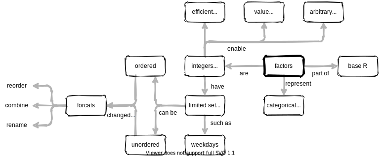
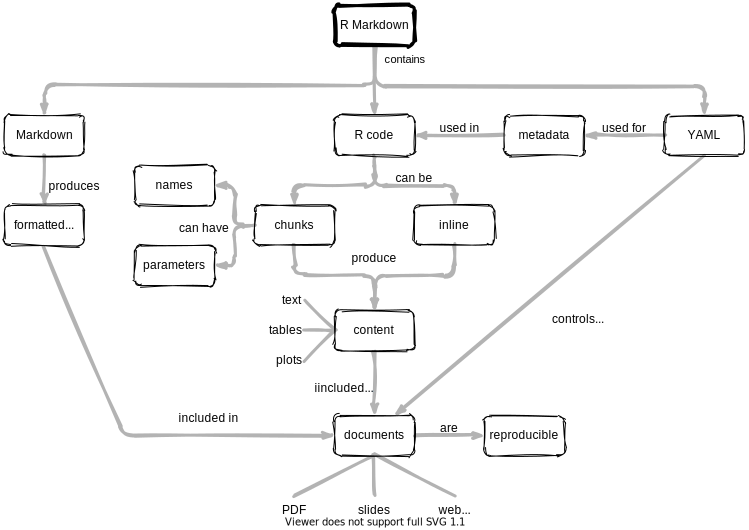
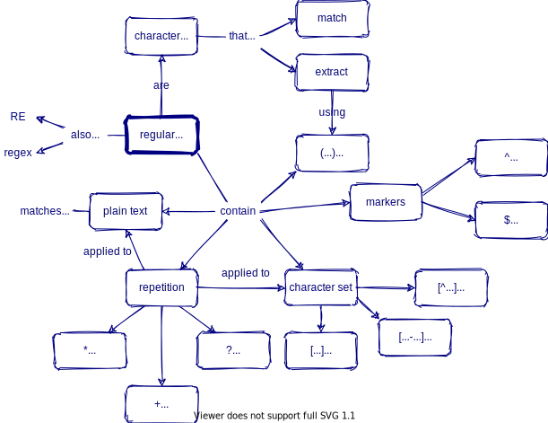
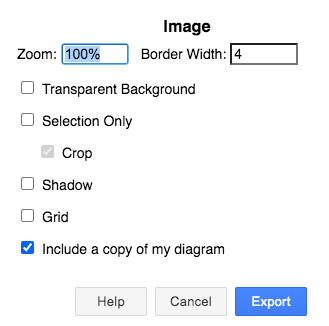

# Concept Maps

Mental models used in introductory data science lessons.

All material made available under the [Creative Commons - Attribution license](LICENSE.md).

## dplyr

[Greg Wilson][wilson-greg]

## select

[Greg Wilson][wilson-greg]

## filter

[Greg Wilson][wilson-greg]

## mutate

[Greg Wilson][wilson-greg]

## group_by and summarize

[Greg Wilson][wilson-greg]

## data types

[Meghan Sposato][sposato-meghan],
[Brendan Cullen][cullen-brendan]

## pivoting

Florian Schmoll

## separate - extract - unite

[Greg Wilson][wilson-greg]

## factors

[Ildiko Czeller][czeller-ildiko], [Graham Parsons][parsons-graham]

## R Markdown

[Gabriela Sandoval][sandoval-gabriela],
[Florencia D'Andrea][dandrea-florencia],
[Yanina Bellini Saibene][bellini-saibene-yanina]

## Regular expressions

[Greg Wilson][wilson-greg]

## Visualization

This one is still unsatisfactory: please [contact us](mailto:greg.wilson@rstudio.com) with suggestions or submit a pull request to this repository.

[Greg Wilson][wilson-greg]

## Pipe Operator

[Jeroen Janssens][janssens-jeroen]

---

## Formatting

-   All diagrams are created with diagrams.net,
    which can be [used online](https://app.diagrams.net/)
    or [downloaded](https://github.com/jgraph/drawio-desktop/releases/tag/v13.6.2)
    from [the project's GitHub repository](https://github.com/jgraph/drawio)
    (approximately 100MB).

-   Save all diagrams as "Editable SVG"
    (a superset of the SVG standard that includes information about anchor points and connections).

-   Use the "Sketch" style,
    which can be chosen from the "Style" menu when no elements are selected.
    (See [this blog post](https://www.diagrams.net/blog/rough-style) for details.)

-   Use #FEFEFF (very pale blue) as a background color
    and #000080 (very dark blue) for lines and text.
    Use 1pt lines, no fill, and 12pt Helvetica.
    If there is a central concept,
    give it a 3pt outline
    and make the text bold and italic

-   Connect both ends of lines to anchor points on concepts
    and move text as needed so that it does *not* lie on the line.

## Exporting

-   Export PNG by selecting everything and then using these settings:
    -   Zoom: 100%
    -   Border Width: 4 pixels
    -   Selection Only
        -   Crop

-   Do *not* select "Transparent Background", "Shadow", "Embed Images",
    or "Include a copy of my diagram".

## Discussion

-   **Why concept maps?**
    They help authors figure out what they want to teach,
    give other instructors a quick overview of a lesson,
    and allow learners to check that they have constructed the right mental model.

-   **What about translations?**
    We hope eventually to be able to store translated text in the `.drawio` files.
    For now,
    please copy an existing diagram and save it in the appropriate language directory
    (e.g., `af/topic.drawio` for concept maps in Afar).

-   **Why SVG?**
    Because vector diagrams rescale much more smoothly than raster images.

-   **Why not use color? Or more shapes? Or...?**
    The simpler these diagrams are,
    the easier they will be to maintain.
    Simple diagrams also display better on smaller or older devices.

-   **Why not use [Graphviz](https://graphviz.org/),
    [DiagrammeR](https://rich-iannone.github.io/DiagrammeR/),
    or some other tool that compiles text into diagrams?**
    1.  As [these graphviz-generated files](./dot/README.md) show,
        it's hard to get their automatic layout algorithms
        to do as good a job as a person can do.
    2.  They have a much steeper learning curve,
        which means fewer people will be able to contribute.
    3.  They don't actually make version control easier
        (reading and understanding the textual description of a diagram
        is as hard as viewing two diagrams side by side).

[bellini-saibene-yanina]: https://yabellini.netlify.app/
[cullen-brendan]: https://bcullen.rbind.io/
[czeller-ildiko]: https://ildiczeller.com/
[dandrea-florencia]: https://florencia.netlify.app/
[janssens-jeroen]: https://jeroenjanssens.com
[parsons-graham]: http://grahamrp.com/
[sandoval-gabriela]: https://twitter.com/GabySandovalM
[sposato-meghan]: https://education.rstudio.com/trainers/people/sposato+meghan/
[wilson-greg]: http://third-bit.com
