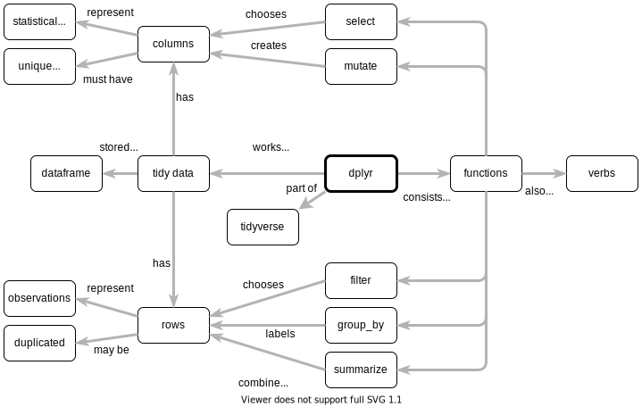
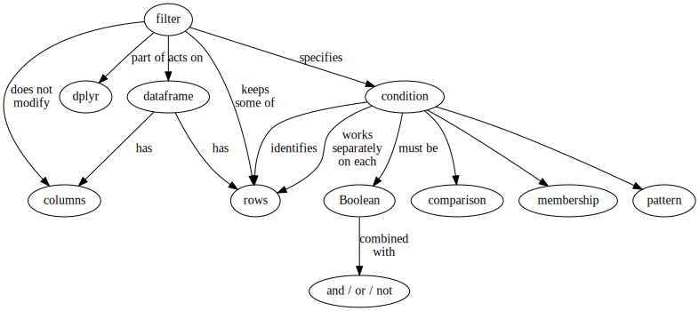
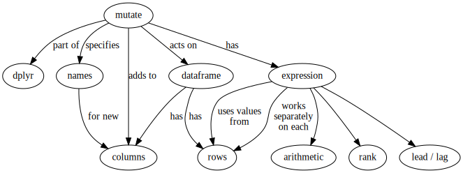
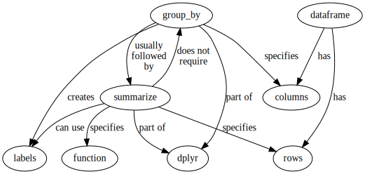
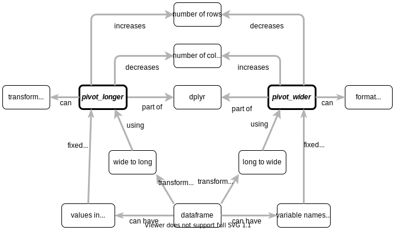

# Concept Maps

Mental models used in introductory data science lessons.

All material made available under the [Creative Commons - Attribution license](LICENSE.md).

## dplyr

<table>
  <tr>
    <td width="50%" align="center">
      
    </td>
    <td width="50%" align="center">
      
    </td>
  </tr>
</table>

[Greg Wilson][wilson-greg]

## Select

<table>
  <tr>
    <td width="50%" align="center">
      
    </td>
    <td width="50%" align="center">
      
    </td>
  </tr>
</table>

[Greg Wilson][wilson-greg]

## Filter

<table>
  <tr>
    <td width="50%" align="center">
      
    </td>
    <td width="50%" align="center">
      
    </td>
  </tr>
</table>

[Greg Wilson][wilson-greg]

## Mutate

<table>
  <tr>
    <td width="50%" align="center">
      
    </td>
    <td width="50%" align="center">
      
    </td>
  </tr>
</table>

[Greg Wilson][wilson-greg]

## Group_by and Summarize

<table>
  <tr>
    <td width="50%" align="center">
      
    </td>
    <td width="50%" align="center">
      
    </td>
  </tr>
</table>

[Greg Wilson][wilson-greg]

## Data Types

<table>
  <tr>
    <td width="50%" align="center">
      
    </td>
    <td width="50%" align="center">
      
    </td>
  </tr>
</table>

[Meghan Sposato][sposato-meghan],
[Brendan Cullen][cullen-brendan]

## Pivoting

<table>
  <tr>
    <td width="50%" align="center">
      
    </td>
    <td width="50%" align="center">
      
    </td>
  </tr>
</table>

Florian Schmoll

---

## Formatting

-   All diagrams are created with diagrams.net,
    which can be [used online](https://app.diagrams.net/)
    or [downloaded](https://github.com/jgraph/drawio-desktop/releases/tag/v13.6.2)
    from [the project's GitHub repository](https://github.com/jgraph/drawio)
    (approximately 100MB).

-   Please save the `.drawio` file and also export an SVG by selecting everything
    and then using these settings:
    -   Zoom: 100%
    -   Border Width: 4 pixels
    -   Transparent Background
    -   Selection Only
        -   Crop

    Do *not* select "Shadow", "Embed Images", or "Include a copy of my diagram".

-   Show concepts with rounded rectangles:
    -   1pt black outline
    -   No fill
    -   12pt Helvetica font
    -   If there is a central concept:
        -   3pt black outline
        -   Make text bold and italic

-   Show relationships with arrows:
    -   3pt dark gray lines (hex code #B3B3B3)
    -   12pt Helvetica
    -   No background for text
    -   Connect both ends to anchor points on concepts
    -   Move text as needed so that it does *not* lie on the line

## Discussion

-   **Why concept maps?**
    They help authors figure out what they want to teach,
    give other instructors a quick overview of a lesson,
    and allow learners to check that they have constructed the right mental model.

-   **What about translations?**
    Please copy an existing diagram and save it in the appropriate language directory
    (e.g., `af/topic.drawio` for concept maps in Afar).

-   **Why SVG?**
    Because vector diagrams rescale much more smoothly than raster images.

-   **Why not use color? Or more shapes? Or...?**
    The simpler these diagrams are,
    the easier they will be to maintain.
    Simple diagrams also display better on smaller or older devices.

-   **Why not use [Graphviz](https://graphviz.org/),
    [DiagrammeR](https://rich-iannone.github.io/DiagrammeR/),
    or some other tool that compiles text into diagrams?**
    1.  As the graphviz-generated files show,
        it's hard to get their automatic layout algorithms
        to do as good a job as a person can do.
    2.  They have a much steeper learning curve,
        which means fewer people will be able to contribute.
    3.  They don't actually make version control easier
        (reading and understanding the textual description of a diagram
        is as hard as viewing two diagrams side by side).

[cullen-brendan]: https://bcullen.rbind.io/
[sposato-meghan]: https://education.rstudio.com/trainers/people/sposato+meghan/
[wilson-greg]: http://third-bit.com
